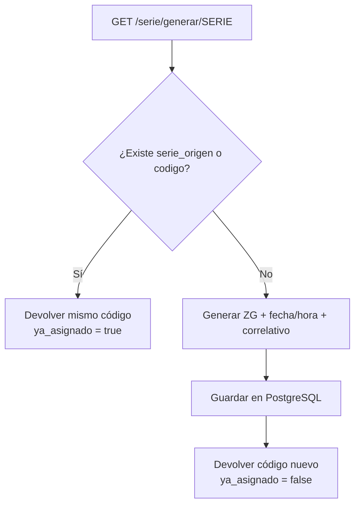

# Flujo de la API ZTrack Serie

Puerto expuesto: **9490**  
Base de datos: **PostgreSQL** (persistencia de códigos, estados e histórico)

---

## 1. Estructura del código generado

```
ZG(AÑO)(MES)(DIA)(HORA)(MINUTO)(SEGUNDO)(CORRELATIVO)
```

| Parte        | Regla                         | Ejemplo |
|--------------|-------------------------------|---------|
| Prefijo      | Fijo `ZG`                     | `ZG`    |
| Año          | 2 dígitos                     | `2026` → `26` |
| Mes          | 2 dígitos con cero a la izquierda | `8` → `08` |
| Día          | 2 dígitos                     | `12` → `12` |
| Hora         | 2 dígitos (24h)               | `14` → `14` |
| Minuto       | 2 dígitos                     | `53` → `53` |
| Segundo      | 2 dígitos                     | `4` → `04` |
| Correlativo  | Empieza en `0`; si hay más en el mismo segundo: `1`, `2`, … | `0` |

**Ejemplo:** `ZG2608121453040`

La fecha/hora se toma en zona horaria `America/Lima` (configurable con `TIMEZONE`).

---

## 2. Flujo principal: generar / recuperar código

### Endpoint

```
GET /monitor/serie/generar/{serie}
```

### Caso A — Dispositivo nuevo (primera vez)

1. El dispositivo llega con una serie inicial (ej. `ZG001`).
2. Se llama:

   ```
   GET http://161.132.53.51:9490/serie/generar/ZG001
   ```

3. La API:
   - Verifica que `ZG001` no exista como `serie_origen` ni como `codigo`.
   - Genera un código nuevo con la estructura anterior.
   - Guarda en BD: `serie_origen = ZG001`, `codigo = ZG2608121453040`, `estado = activo`.
   - Responde con el código nuevo.

**Respuesta ejemplo:**

```json
{
  "mensaje": "Código generado y asignado correctamente",
  "ya_asignado": false,
  "serie_origen": "ZG001",
  "codigo": "ZG2608121453040",
  "estado": "activo",
  "creado_en": "2026-08-12T14:53:04-05:00"
}
```

### Caso B — Ya tiene código asignado

Si se vuelve a llamar con la serie origen **o** con el código ya generado:

```
GET http://161.132.53.51:9490/serie/generar/ZG2608121453040
```

o

```
GET http://161.132.53.51:9490/serie/generar/ZG001
```

La API **no crea un código nuevo**. Devuelve el mismo y indica que ya está asignado:

```json
{
  "mensaje": "El código ya está creado y asignado",
  "ya_asignado": true,
  "serie_origen": "ZG001",
  "codigo": "ZG2608121453040",
  "estado": "activo",
  "creado_en": "2026-08-12T14:53:04-05:00"
}
```



---

## 3. Rutas de gestión

### 3.1 Modificar código

```
PUT /serie/modificar/{codigo}
```

Cuerpo JSON:

```json
{
  "nota": "Equipo instalado en planta Lima",
  "motivo": "Actualización de información"
}
```

- Actualiza la nota del registro.
- Registra el cambio en `historial_modificaciones` (campo, valor anterior, valor nuevo, motivo, fecha).

### 3.2 Archivar código

```
PUT /serie/archivar/{codigo}
```

Cuerpo JSON (opcional):

```json
{
  "motivo": "Equipo dado de baja"
}
```

- Cambia `estado` a `archivado`.
- Guarda `archivado_en`.
- Deja constancia en el histórico.

### 3.3 Último código creado

```
GET /serie/ultimo
```

Devuelve el más reciente con fecha de creación e histórico de modificaciones.

### 3.4 Últimos 10 códigos

```
GET /serie/ultimos
```

Lista los 10 más recientes (orden descendente por `creado_en`).

### 3.5 Todos los códigos

```
GET /serie/todos
```

Lista completa de códigos almacenados.

### 3.6 Estadísticas

```
GET /serie/estadisticas
```

```json
{
  "hoy": 3,
  "esta_semana": 12,
  "este_mes": 45,
  "este_anio": 120,
  "total_activos": 100,
  "total_archivados": 20,
  "total": 120
}
```

Rangos calculados en zona `America/Lima`:
- **hoy:** desde 00:00 del día actual
- **esta_semana:** desde lunes 00:00
- **este_mes:** desde día 1 del mes
- **este_anio:** desde 1 de enero

---

## 4. Modelo de datos (resumen)

### `series_codigos`

| Campo          | Descripción                          |
|----------------|--------------------------------------|
| serie_origen   | Serie enviada al generar (ej. ZG001) |
| codigo         | Código ZG generado                   |
| estado         | `activo` / `archivado`               |
| nota           | Información editable                 |
| creado_en      | Fecha/hora de creación               |
| actualizado_en | Última actualización                 |
| archivado_en   | Fecha de archivado (si aplica)       |

### `historial_modificaciones`

| Campo          | Descripción                |
|----------------|----------------------------|
| serie_id       | FK al código               |
| campo          | Campo modificado           |
| valor_anterior | Valor previo               |
| valor_nuevo    | Valor nuevo                |
| motivo         | Motivo informado           |
| creado_en      | Cuándo ocurrió el cambio   |

---

## 5. Cómo levantar el servicio

```bash
docker compose up -d --build
```

Contenedores (nombres distintos para evitar conflicto con otros ZTrack):

| Servicio compose | Contenedor |
|------------------|------------|
| `api` | `ztrack_api_serie` |
| `db` | `ztrack_db_serie` |

- UI/API: `http://localhost:9490/monitor/`
- Login: `http://localhost:9490/monitor/serial/login.html`
- Docs Swagger: `http://localhost:9490/docs`
- Health: `http://localhost:9490/monitor/health`
- PostgreSQL host (opcional): puerto `9543` → contenedor `5432`  
  (la API usa la red interna `db:5432`, no necesita este puerto)

```bash
docker logs -f ztrack_api_serie
docker compose down
```

---

## 6. Ejemplos rápidos con curl

```bash
# Generar
curl -s http://localhost:9490/serie/generar/ZG001

# Reintentar (mismo código)
curl -s http://localhost:9490/serie/generar/ZG001

# Modificar
curl -s -X PUT http://localhost:9490/serie/modificar/ZG2608121453040 \
  -H "Content-Type: application/json" \
  -d '{"nota":"Instalado","motivo":"Alta inicial"}'

# Archivar
curl -s -X PUT http://localhost:9490/serie/archivar/ZG2608121453040 \
  -H "Content-Type: application/json" \
  -d '{"motivo":"Baja"}'

# Consultas
curl -s http://localhost:9490/serie/ultimo
curl -s http://localhost:9490/serie/ultimos
curl -s http://localhost:9490/serie/todos
curl -s http://localhost:9490/serie/estadisticas
```
