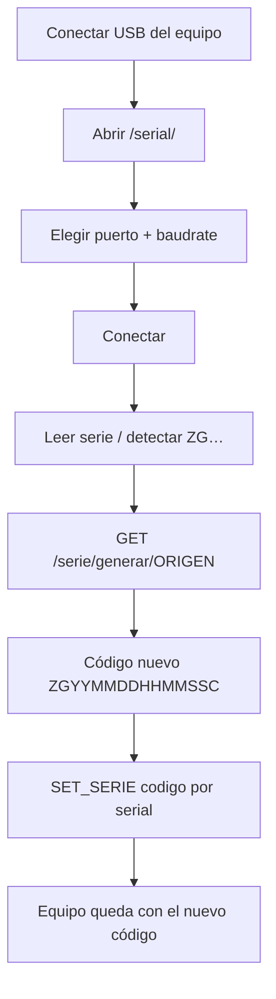

# Flujo Serial Web ZTrack

Herramienta web para configurar equipos de telemetría **sin Arduino IDE**: conectar por USB/serial, detectar el código del equipo y asignarle el código ZG generado por la API.

UI: `http://localhost:9490/serial/`  
API códigos: puerto `9490` (ver `flujo.md`)

---

## 1. Objetivo

| Antes | Ahora |
|-------|--------|
| Monitor Serial de Arduino IDE (instalación pesada, distinta por SO) | Navegador (Chrome/Edge/Firefox) o Chrome Android + USB-OTG |
| Copiar/pegar serie a mano | Detectar por serial + generar con API + escribir al equipo |

---

## 2. Arquitectura (transporte conmutable)

```
[ UI Serial Web ]
       |
       +--(1) Agente local 127.0.0.1:8765  → nombres COM/tty reales
       |
       +--(2) Web Serial API (navegador)   → selector de puerto del SO
       |
       +--(3) Sin soporte                   → pantalla de ayuda
```

Al cargar la página:

1. Intenta `GET http://127.0.0.1:8765/salud` (300 ms).
2. Si responde → modo **Agente**.
3. Si no y existe `navigator.serial` → modo **Web Serial**.
4. Si no → ayuda (Safari/iOS no soportan Web Serial).

La generación de códigos siempre llama a:

```
GET /serie/generar/{serie_origen}
```

---

## 3. Flujo de trabajo en planta



### Pasos

1. Conecta el dispositivo de telemetría por USB.
2. Abre **Serial Web** en el navegador.
3. **Conectar** (Web Serial pedirá elegir el puerto; el agente lista COM/tty).
4. **Leer serie** (envía `SERIE?`) o deja que el monitor detecte un `ZG…` en el log.
5. **Generar y escribir al equipo**:
   - Llama a la API con el código origen (ej. `ZG001`).
   - Recibe `ZG2608121453040` (o el ya asignado).
   - Envía `SET_SERIE ZG2608121453040` por serial.

Si vuelves a generar con el mismo origen o con el código ya creado, la API **no inventa otro**: responde que ya está asignado.

---

## 4. Protocolo serial esperado en el firmware

Por defecto la UI usa:

| Acción | Comando enviado |
|--------|-----------------|
| Consultar | `SERIE?\n` |
| Asignar | `SET_SERIE {codigo}\n` |

El firmware debe:

- Responder a `SERIE?` con una línea que contenga el código (ej. `SERIE=ZG001` o solo `ZG001`).
- Aceptar `SET_SERIE ZG…` y persistirlo (EEPROM/NVS).
- Opcionalmente imprimir el código al arrancar (el monitor lo detecta solo).

Los comandos son editables en la UI (sección *Comandos serial*).

Ejemplo mínimo Arduino/ESP:

```cpp
String serie = "ZG001";

void setup() {
  Serial.begin(115200);
  Serial.println(serie);
}

void loop() {
  if (!Serial.available()) return;
  String line = Serial.readStringUntil('\n');
  line.trim();
  if (line == "SERIE?") {
    Serial.println(serie);
  } else if (line.startsWith("SET_SERIE ")) {
    serie = line.substring(10);
    serie.trim();
    // TODO: guardar en EEPROM/NVS
    Serial.print("OK ");
    Serial.println(serie);
  }
}
```

---

## 5. Plataformas

| Entorno | Cómo |
|---------|------|
| Windows / Linux / macOS escritorio | Chrome/Edge/Opera o Firefox reciente → Web Serial |
| Linux con nombres de puerto reales | Instalar **agente local** |
| Android | Chrome + cable **USB-OTG** + equipo; página por **HTTPS** |
| iPhone / Safari | No soportado (Apple no expone Web Serial) |

### Celular (Android)

1. Levanta la API con HTTPS:
   ```bash
   ENABLE_HTTPS=1 docker compose up -d --build
   ```
2. En el teléfono abre `https://<IP-LAN>:9490/serial/` (acepta el certificado autofirmado).
3. Conecta el equipo con adaptador USB-OTG.
4. Chrome → **Conectar** → autoriza el puerto serial.

Web Serial **no funciona por HTTP plano en una IP de LAN**; necesita HTTPS o localhost.

---

## 6. Agente local (opcional)

Úsalo cuando necesites lista real de puertos (`COM3`, `/dev/ttyUSB0`, `/dev/cu…`).

```bash
cd /ruta/serie_ztrack
python -m venv .venv-agent
source .venv-agent/bin/activate   # Windows: .venv-agent\Scripts\activate
pip install -r agent/requirements.txt
python -m agent
```

- Solo escucha en `127.0.0.1:8765`
- Token por defecto: `ztrack-local`
- La UI lo detecta sola y cambia a modo **Agente**

---

## 7. Linux: permisos USB

```bash
sudo cp deploy/99-ztrack-serial.rules /etc/udev/rules.d/
sudo udevadm control --reload-rules && sudo udevadm trigger
```

Si un CH340 “desaparece”, revisa `brltty`. Si hay basura AT al conectar CDC, revisa ModemManager (las reglas ya marcan `ID_MM_DEVICE_IGNORE`).

---

## 8. Monitor bajo caudal alto (equipos que spamean UART)

El firmware de telemetría emite muchas líneas (`AT SEND`, `ERROR SIM`, `ETILENO…`). Si la UI crea un nodo DOM por línea, el hilo principal se satura → **BufferOverrun** en Web Serial → el monitor se “congela” aunque Arduino IDE siga bien.

Mitigaciones implementadas en `/serial/`:

| Mecanismo | Efecto |
|-----------|--------|
| Lectura RX desacoplada (copia buffer + cola) | El `read()` no espera al DOM |
| Render por lotes (`textContent` + rAF) | Una pintura por frame, no cientos |
| Tope 400 líneas / cola con descarte | Memoria y layout acotados |
| Reenganche tras error de stream | Se recupera de overrun/framing |
| Auto-reconexión al reenchufar USB | Como el monitor de Arduino al reconectar |
| Pausar vista | Sigue leyendo el puerto sin pintar |
| Indicador `B/s` | Confirma que RX sigue vivo |

Si ves `↓N` en el medidor, la UI descartó líneas viejas a propósito para no colgarse.

---

## 9. Matriz rápida de prueba

- [ ] Conectar Uno/CH340/CP2102 a 115200
- [ ] Ver RX continuo ~1 min sin congelarse (medidor B/s vivo)
- [ ] Desenchufar y reenchufar → reconecta solo
- [ ] `Leer serie` → rellena código origen
- [ ] `Generar y escribir` → API + `SET_SERIE`
- [ ] Reintentar generar → mismo código, mensaje ya asignado
- [ ] Android OTG + HTTPS
- [ ] Puerto ocupado por Arduino IDE → mensaje claro
